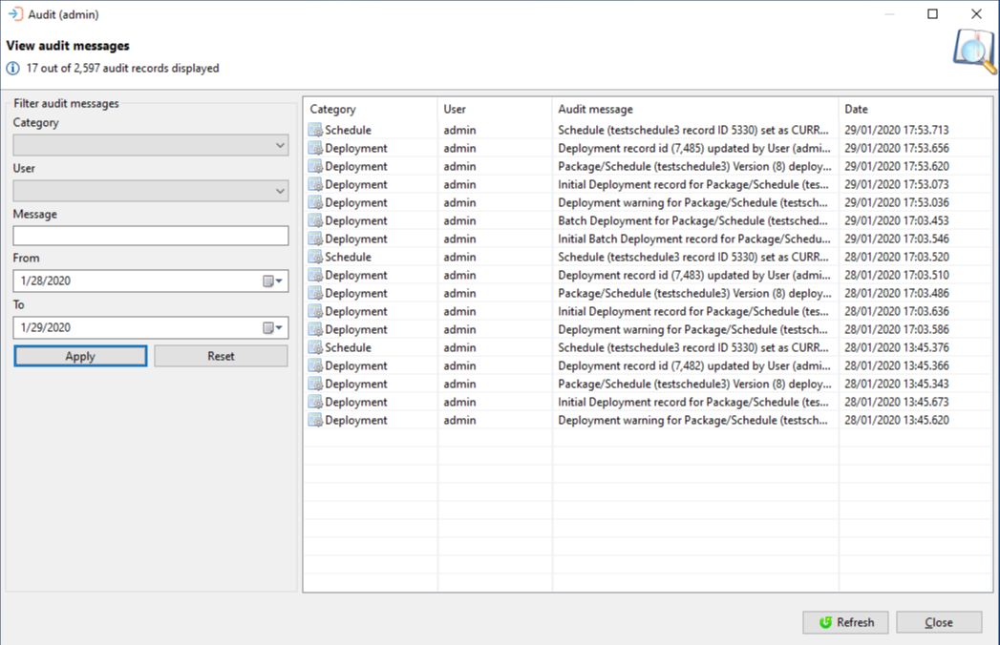

# Audits

When working with the OpCon Deploy, all actions performed by users are audited and entries inserted into the Audit table. The entries consist of an audit category, a timestamp, a description, and the user who performed the action.

The Audit function provides query access to the Audit database table and allows a user who has the Administration role to perform to perform queries on the table. The queries are performed by selecting filters then selecting the Apply button. The filters consist of category, user, a string value, a start date, and an end date.

To update the list of records displayed in the Audit Queries window, click Refresh, located in the bottom right corner of the window next to the Close button.

## Filter Audit Messages Section

This section contains information about the filters and controls that can be used when performing queries.

### Category

The category to perform the query against 

The following categories are defined:
* Deployment - With this category, user actions are performed during deployment functions.
* Package - With this category, user actions are performed during package functions.
* Schedule - With this category, user actions are performed during schedule functions.
* Server - With this category, user actions are performed during server functions.
* TransformationRule - With this category, user actions are performed during transformation rule actions.
* User - With this category, user actions are performed during user functions.
* GlobalRule - With this category, user actions are performed during GlobalRule functions.

### User

The defined user name to perform the query against

### Message

A string that will be used to scan the Audit message for a match during the query

### From

The start date of the query

### To

The end date of the query

### Apply

When the filter criteria has been selected, use the Apply button to submit the request

### Reset

If required, use the Reset button to return to the default values
