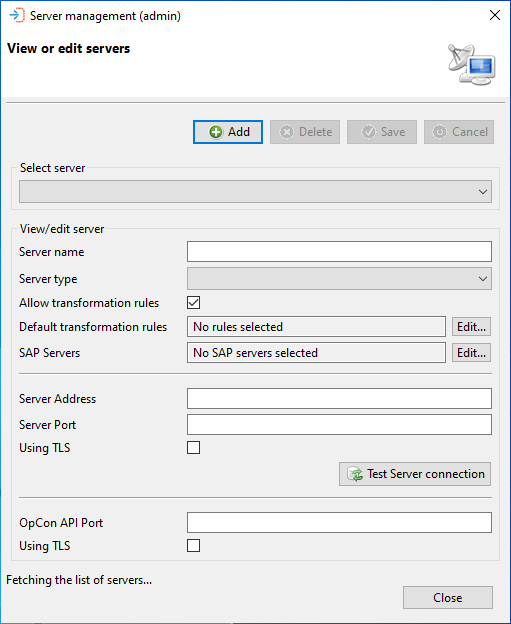
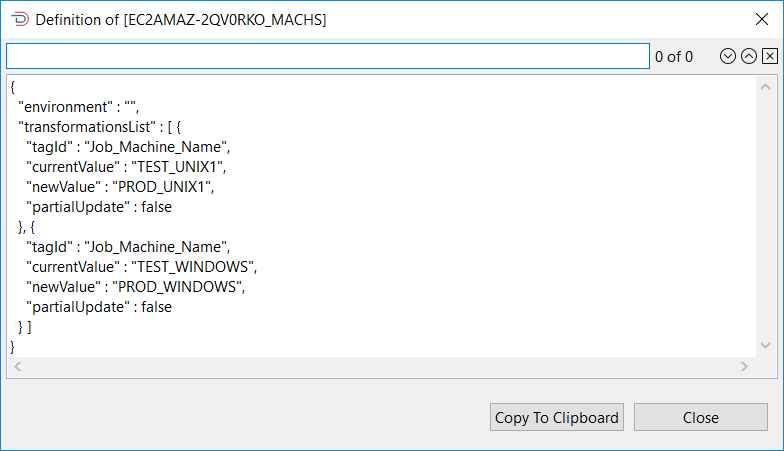
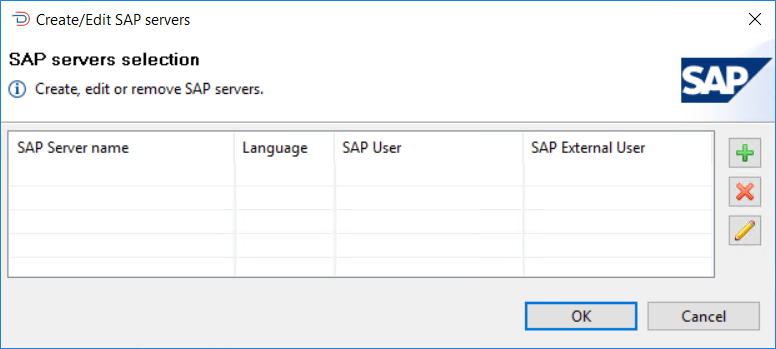
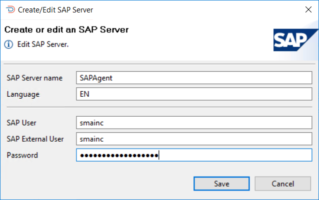

# Servers

When working with the OpCon Deploy, each OpCon system that is used to import schedules from or deploy schedules to must be defined.

Servers are associated with roles that define their capability within the application.

For access to OpCon systems, the server definition contains the information required to connect to the ImpEx2 RESTFul server and the OpCon RestAPI of the OpCon system. The ImpEx2 RESTFul server provides access to the OpCon system while the OpCon RestAPI is used to access specific functions.

If the OpCon system supports SAP agents, the SAP agents must be configured to support the SAP functions to extract SAP job definitions, to link SAP job definitions, and to create SAP job definitions.

The Servers function allows servers to be managed in OpCon Deploy. It is possible to Add, Delete, or Update (Save) server information.

## Select Server Section

When working with the View or edit servers dialog, the information of an existing server can be displayed by selecting the server from the Select server drop-down list. Once the server has been selected, the information is displayed in the View/edit server section. Password values are not displayed.

Once the server information has been displayed, the server can be removed from the application by selecting the Delete button. Before deleting the record, a confirmation message will be displayed.

If changes are made to the server information, then the Save and Cancel buttons will be enabled.

## View/Edit Server Section

This list contains descriptions of each field in the View/edit server section of the View or edit servers dialog.

### Server Name

The name of the OpCon system
* This must be a unique name within the OpCon Deploy system.

### Server Type

The type of server
* The type of server is used to determine what action to take when deploying a schedule and the schedule already exists on the target system. This value is also used in conjunction with the user role value and determines which OpCon systems a user may access to import and deploy schedules.
* During deployment, if the target server is a production server, a comparison is made between the current deployed schedule and the value saved in the previous deployment record.
* For all other deployments, a check is made to see if the schedule exists on the target system.
Production servers include: Pre-production, Production and Training server types.
* Non-production server types are listed as the following: Development, Integration, Quality Assurance, System Test, Test.

### Allow Transformation Rules

When selected, this option allows the transformation of the schedule definitions
* If not selected and transformation rules are specified, a deployment operation will fail if the Fail if Transformation Rules present and Transformation disabled global rule is enabled.

### Default Transformation Rules

It is possible to define a set of transformation rules that will always be applied when the server is selected as a target during deployment

### Server Address

The address (IP address or DNS) of the OpCon Impex RESTFul server associated with the OpCon system

### Server Port

The port of the OpCon Impex RESTFul server (9001 for non-TLS, 9011 for TLS)

### Using TLS

Indicates if the connection to the Impex RESTFul server uses TLS

### OpCon API Port

The port of the OpCon RestAPI server (default 9010)

### Using TLS

Indicates if the connection to the OpCon RestAPI server uses TLS

When adding default transformation rules to the server, select the Edit button and the **Select one or more rules** dialog will appear.

The Select one or more rules dialog presents a screen and a **Select** capability that allows you to enter a text string in the **Filter** field to retrieve specific transformation rule records or use the displayed default value of asterix (*) to retrieve all transformation rule records. If there are any records previously entered, they will be displayed in the selection and selected sections of the dialog. Once the text string has been entered select the **Refresh** button and the transformation rule information will be displayed. Subsequent requests will be added to the existing list. The **Clear** button can be used to reset the list of previously selected transformation rules. Transformation rules selected in the lower table, will remain in the upper selection screen after a reset.

It must be noted that wild cards are not supported, instead the text entered in the **Filter** field is checked against the transformation rule name in the transformation rule record (i.e. HP will return all script records that contain the character sequence in the name).

To add a transformation rule, either double-click on the rule in the upper table or select the rule in upper table then click the Include arrow. To remove a transformation rule, either double-click or select the rule in the lower table and the click the Remove arrow.

To view the Transformation Rule definitions, perform a right-click on the definition in the list (upper or lower tables) and View Definition will appear. Select this to view the JSON definition, as shown in the Viewing Transformation Rules Definitions from Server graphic.

It is possible to search for a value in the JSON by entering the required value in the search field above the definition and selecting a search direction (forward or backward arrow). Selecting the X will remove the search result from the definition and the search field.

When adding SAP server definitions to the server, select the Edit button associated with the SAP servers and the SAP servers selection dialog will appear.

To add a new SAP server, select the + button and the Create or edit an SAP Server dialog will appear.

This list contains descriptions of each field in the Create or edit an SAP Server dialog.

### SAP Server Name

The name of the SAP R3 Agent on the OpCon system

### SAP Language

The language used by the SAP system (example **EN** for English, **F** for French)

### SAP User

The name of the SAP user who has the rights to access the SAP system through the XBP interface
* It is the same user defined within the SAP Agent definition.

### SAP Password

The password of the SAP user
* The password is entered in plain text as the software will encrypt the password value before storing it in the database.
