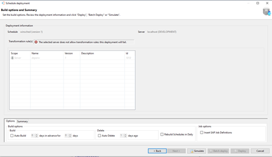
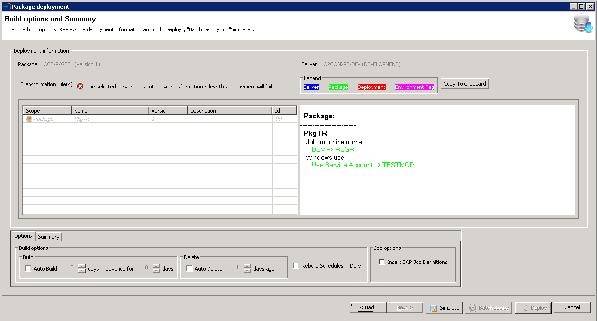
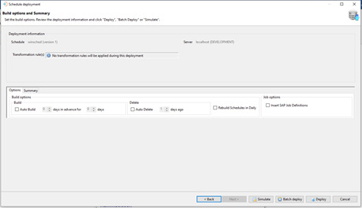

# Deployments - Browse

The Browse function can be used to examine the contents of a deployment record as well as submit a rollback request. When browse is selected, the View deployment records dialog appears.

[View Deployment Records Dialog](View Deployment Records Dialog)

To update the list of records displayed in the View Deployment Records window, click Refresh, located in the bottom right corner of the window next to the Close button.

## Browse Actions

It is possible to perform actions on the records displayed in the Browse Deployment dialog. Right-clicking on a record will present all possible actions for that schedule or package:

### Browse Actions and Descriptions

| Action | Description |
| ------ | ----------- |
| View definition | Displays the definition that was deployed to the target system |
| View rollback definition | Will display the definition that was retrieved from the target system before the deployment was performed |
| Rollback this deployment | This action may only be performed on an active instance and will rollback the definition to the previous state (using the definition retrieved during the deployment process) |
| Delete this deployment | Can only be performed on an active instance and will delete the definition from the OpCon system |
| Cancel this batch deployment | Can only be used on a batch deploying instance and is used to cancel the batch deployment process |

The View deployment records dialog presents a list of all deployment records. The information displayed consists of the following:

### View Deployment Records Dialog

**Name**	

* The package, schedule, or script name.

**Original Name**	

* Displays the original name of the schedule 
    * This can be different from the "Name" column if the schedule name is transformed during deployment

**Version**	

* The version of the package, schedule, or script

**Server**	

* The system to which the package, schedule, or script was deployed.

**Type**

* Is the deployment a package, schedule, or script?
    * values: Package, Schedule, or Script

**Status**

* The status of this deployment on the server

    * values for schedule or package: Active, Cancelled, Deploying, Inactive, Deleted or Rolledback
    * value for script: Deployed

**Description**	

* The description of the deployment

**Transformation Used**	

* Indicates if the transformation rules have been used in this deployment 
    * This indication does not include transformation rules included as part of the server definition

**User**	

* The name of the user who performed the last action on the deployment record

**Date**	

* A timestamp when the last action was performed

## Filter Deployment Records Section

This section contains information about the filters and controls that can be used when examining deployment records.

### Filter Deployment Records Section

| Field/Control | Description |
| ------------- | ----------- |
| Schedule | Provides a list of schedule names in a drop-down list |
| Server | Provides a list of server names in a drop-down list |
| Deployment Type | Allows the selection of either package or schedule from a drop-down list |
| User | Allows selection of a user from the drop-down list |
| From | The start date |
| To | The end date |
| Apply | When the filter criteria has been selected, use the Apply button to submit the request |
| Reset | If required, use the Reset button to return to the default values |

The View deployment records dialog provides four actions that can be performed on a deployment record. To perform an action, right-click on the deployment record and a small menu consisting of the following options will become visible:

### View Deployment Records Right-Click Menu

**View definition**

* Presents the deployment definition associated with this deployment
    * Includes any transformations applied to the definitions 
    * For a package deployment, it contains the complete deployment information containing multiple schedule definitions if a package consists of more than 1 schedule
    * Not supported for Script deployment

**View rollback definition**	

* Presents the saved definition retrieved from the target system during the deployment process
    * Not supported for Script deployment

**Rollback this deployment**

* Initiates a rollback of the deployment to the definition saved during the deployment process
    * Not supported for Script deployment

**Delete this deployment**	

* Removes the schedule or package from the OpCon system
    * When executing this command, it should be noted that any schedules in the daily will also be removed
    * Not supported for Script deployment

## Server does not allow Transformations/No Rules Selected for Deployment

In some cases, transformation rules that have been selected cannot be included because the server that the deployment is going to does not allow transformation rules.

If this happens when deploying a schedule, the transformation rules that were to be added to this deployment will appear in the selection window but will not be selectable. A warning message on the Build Options and Summary screen reading: "The selected server does not allow transformation rules: this deployment will fail" appears in place of the usual information message stating the number of rules in the deployment:

At this point, the deployment cannot be completed. You may choose to go back to the previous screen, simulate a deployment, or cancel the current deployment. The Batch Deploy and Deploy buttons will be disabled.

The same thing happens when deploying a package. If the target server does not support transformation rules, the deployment will not be able to be completed and the warning message "The selected server does not allow transformation rules: this deployment will fail" will appear.

The package deployment transformation rules will appear on the Build options and Summary screen but will not be selectable, and the Deploy buttons will be disabled.

Click the Back button to return to the previous screen, or Cancel to cancel the deployment.

A similar situation occurs if the server being deployed to does not accept transformation rules and rules have not been previously saved for the deployment. An information message will appear stating: "No transformation rules will be applied during this deployment":

In this case, the deployment can be completed with no transformation rules being applied. The same information alert message will display for deployments that have no transformation rules selected and the server does not allow for transformation rules.

