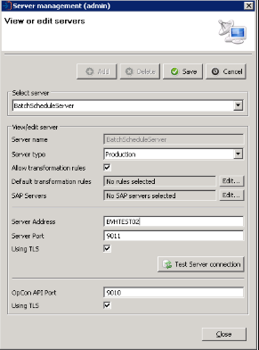
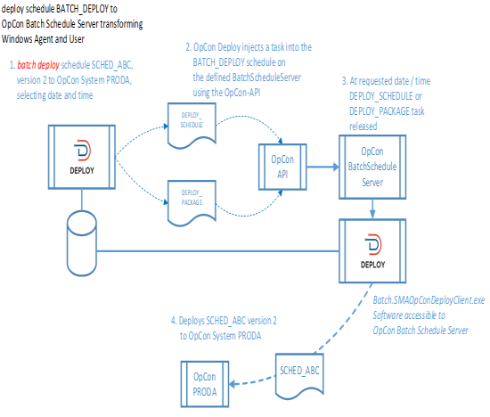

# Scheduled Batch Deployment

When performing a deployment using the OpCon Deploy client, there is a "Batch Deploy" option that can be used to schedule the deployment for a future date and time. After the batch deployment is scheduled, the batch deployment process begins, which involves the batch schedule server and the ```BATCH_DEPLOY``` schedule. It is required that the batch schedule server and ```BATCH_DEPLOY``` schedule are set up correctly before a batch deployment can be scheduled.

## Batch Schedule Server

One of the OpCon systems that is participating in the OpCon Deploy environment should be designated as the "Batch Schedule Server". This server will be used to schedule batch deployments at the requested date and time, archive tasks, and perform database backups.

### Setting Up the Batch Schedule Server

1. OpCon RestAPI
    * Must be installed using TLS with an internal certificate.
    * Start the services for OpCon RestAPI and OpCon Service Manager.
2. Install Solution Manager and start the service.
3. OpCon Deploy
    * Run the OpCon Deploy installer to install the Client and Server software. During install, configure the client to connect to the OpCon Deploy database.
    * Start the service OpCon Impex2 RestAPI.
4. Install a Windows agent if one is not available.
    * Start the service for the Windows agent and the associated JORS.
5. In OpCon Deploy, define the BatchScheduleServer if it does not already exist.
    * Login to the OpCon Deploy client as a user with Admin privileges.
    * Add a server with the name "BatchScheduleServer" and point to the above identified batch schedule server:



## BATCH_DEPLOY Schedule

The ```BATCH_DEPLOY``` schedule must be available on the batch schedule server. Follow the steps below to add it if not available.

1. Import the schedule from the file. If OpCon Deploy is installed to the default location, the schedule definition file for ```BATCH_DEPLOY``` will be available at ```C:\ProgramData\OpConxps\Deploy\Client\templates\BATCH_DEPLOY.json```.
2. Create transformation rules to transform the schedule to match the batch schedule server environment.
    * Job: machine name. The current value is: ```BVHTEST02```. Replace this value with the name of a communicating Windows agent in the batch schedule server environment.
    * Property name. Global property “SMADeployPath” is for the OpCon Deploy install location where the ```Batch.SMAOpConDeployClient.exe``` application resides. The current value is: ```C:\Program Files\OpConxps\Deploy\Client\```. Replace this value with the actual location.
    * Windows user. The current value is: ```Use Service Account```. Replace this value with a desired user if needed.
3. Deploy the BATCH_DEPLOY schedule, with transformation rules, to the BatchScheduleServer.
4. Review the ```DEPLOY_SCHEDULE``` and ```DEPLOY_PACKAGE``` task to make sure the definitions match the server environment.
5. (*Optional*) Set auto build values for the schedule as required.

## Schedule the Batch Deploy

The scheduled batch deployment process begins with the selection of the schedule or package to be deployed, the selection of the target OpCon server, and then transformation rules, if required. Once the selection is completed, the “Batch deploy” button can be selected, which will open the Batch Deployment dialog. Provide the desired date and time for the deployment. Also enter the password for the OpCon Deploy user, if required.

## Batch Deployment Process

An overview of the Batch Deployment Process is displayed in the image below:



After the batch deployment is successfully scheduled, the ```BATCH_DEPLOY``` schedule is built into daily for the specified batch deploy date on the batch schedule server. OpCon Deploy then injects either a ```DEPLOY_SCHEDULE``` or ```DEPLOY_PACKAGE``` task into the ```BATCH_ DEPLOY``` schedule using the OpCon RestAPI.

If the task is injected correctly into the ```BATCH_DEPLOY``` schedule, a successful completion message is displayed to the user and a record is inserted into the Deployment table, indicating that the schedule or package has been scheduled for future deployment.


