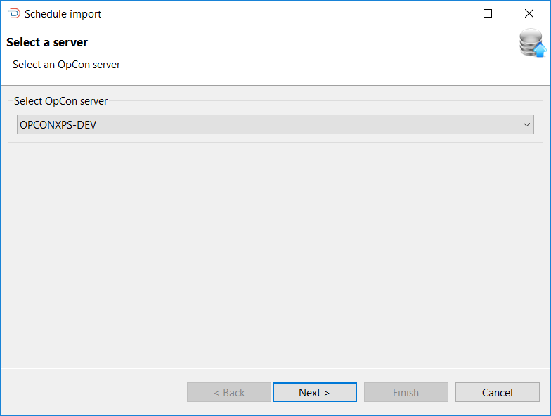
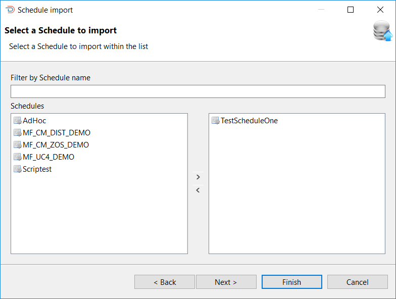
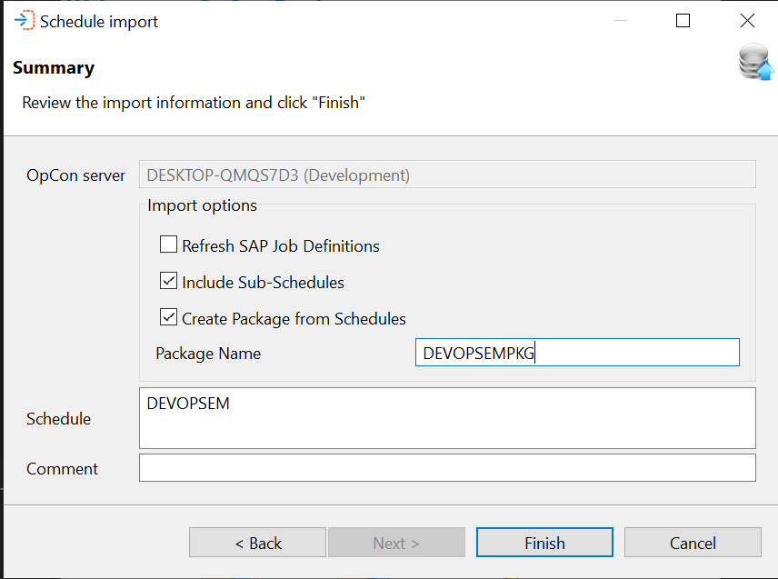
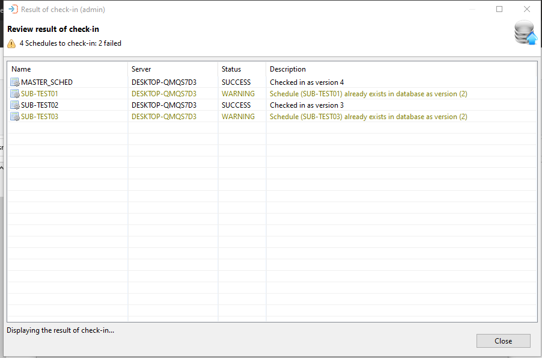
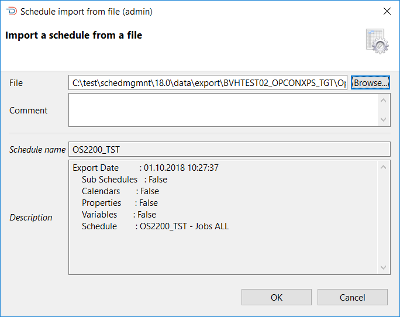
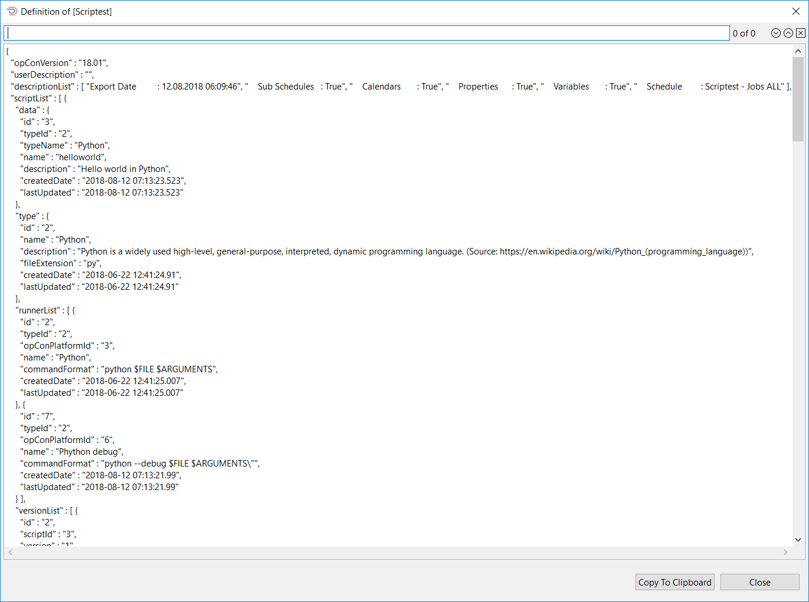

# Schedules

The Schedules functions support the capabilities required to import and view schedule definitions.

Before a schedule definition can be deployed to a target OpCon system, it must be registered with the OpCon Deploy system. Once registered, it can be included in a package for deployment or it can be deployed to target OpCon systems.

## Import

The import function is used to register a schedule definition with the OpCon Deploy system. During the import process, the schedule definition is selected from a source OpCon system, the schedule definition is extracted from the source OpCon system, converted into an JSON representation, and saved in the central repository.

A check is made during the import process to determine if the definition to be imported matches the latest version in the OpCon Deploy database. If there is a match, the import is terminated and an error message indicating the new definition matches an existing version is displayed.

The import process is divided into two distinct phases with the first phase being the selection phase and the second phase the confirmation phase.

OpCon Deploy requires that each OpCon system participating in the OpCon Deploy environment requires a license. To enforce this, a check is made to determine if the requested system has a valid OpCon Deploy license. If the system does not have a valid license, the following message will be displayed:

## Import Selection Phase

The import process begins with the selection of the OpCon system to import the schedule from. Following that, various dialogs will be presented leading the user through the process.

To start the Import, select the Schedules Import function. The Schedule Import (Select a server) dialog appears and you will need to select, from the drop-down list, the OpCon system from which to import the schedule and then select the Next button. It should be noted that only OpCon systems defined in the SMAOpconDeploy database will appear in the list.

Once Next has been selected, the list of schedules will be retrieved from the chosen OpCon system and displayed in the schedules list of the Schedule Import (Select a Schedule to import) dialog. Once the schedule list has been created, it is possible to filter the schedule names on the list by entering a value in the Filter by Schedule Name field. It is possible to select multiple schedules to import from the source OpCon system by selecting the schedule names and then using the > arrow to move the schedules names to the right-hand list. Once schedule(s) has been selected, select the Next or Finish button.

Once Next has been selected, the selected schedule(s) will be displayed in the Schedule Import (Summary) dialog appears. This provides a summary of your selections, allows selection of import options and allows a description to be added to the import process.
Supported IMport Options:
- **Refresh SAP Job Definitions** indicates if OpCon SAP R3 jobs are encountered in the schedule, then the SAP server job definitions should be extracted from the SAP server (otherwise, uses values in 13100 and 13101 records).
- **Include Sub-Schedules** indicates if container jobs are encountered in the schedule, the associated sub-schedule should be included in the import process. The schedules are checked recursively and each sub-schedule is imported as a separate schedule. The result of all schedule imports is displayed in the results message.

If the schedule(s) has been inserted successfully into the repository, you will get a success message indicating that the schedule has been inserted as version (*n*) for each selected schedule. During the schedule import process a check is made to see if the schedule definition matches the current version in the Deploy database. If this is the case, a warning message will be displayed indicating that the schedule already exists in the database a version (*n*);

## Import File

The Import File function is used to register a schedule definition (contents must be in .JSON format) with the OpCon Deploy system from a file. During the process, the file is selected using the Browse... function. When the file is read in, a check is automatically performed to see if the format is valid.

When the file is read in, the information contained in the descriptionList will be displayed in the Description section.

To insert the definition in the repository, select the OK button. A message will be displayed asking confirmation that the schedule must be imported into the repository. If YES is selected, the schedule will be imported into the repository and a completion message will be displayed indicating that the schedule was inserted as version (*n*).

## Browse

The Browse function provides the opportunity to display information about schedule definitions in the repository.

The Browse and filter Schedules imported dialog presents a list of all schedule records. This next table describes the information displayed in the dialog.

To update the schedule list in the Browse and filter Schedules imported window, click the Refresh button.

### Browse and Filter Schedules Imported Columns

| Column | Description |
| ------ | ----------- |
| Name | The name of the schedule |
| Sub | If the schedule definition contains references to a subschedule |
| Dep. | If the schedule definition contains external dependencies |
| Description | The description entered when importing the definition |
| OpCon Server | The OpCon server that the schedule was imported from |
| OpCon Version | The version of the OpCon system the definition was created on |
| Current Production | If the definition is currently deployed to a production system (will display which version of the schedule is deployed) |
| User | The name of the user that performed the last action on the schedule definition |
| Date | A timestamp when the last action was performed |

The high-level entry in the table will indicate which version is deployed to production and when the versions of the entry are examined, a check mark will indicate which version is deployed to production.

To view the schedule definitions, perform a right-click on the definition in the list and View Definition will appear then select this to view the JSON definition.

It is possible to search for a value in the JSON by entering the required value in the search field above the definition and selecting a search direction (forward or backward arrow). Selecting the X will remove the search result from the definition and the search field.

## Create Diagram

To create a diagram of the Schedule definition, right-click on the definition in the list. Create Definition will appear and you will select this to create the diagram. The diagram will then be displayed in a PDF form. Please refer to the topic [Package and Schedule Diagram](package-and-schedule-diagram) for more information.