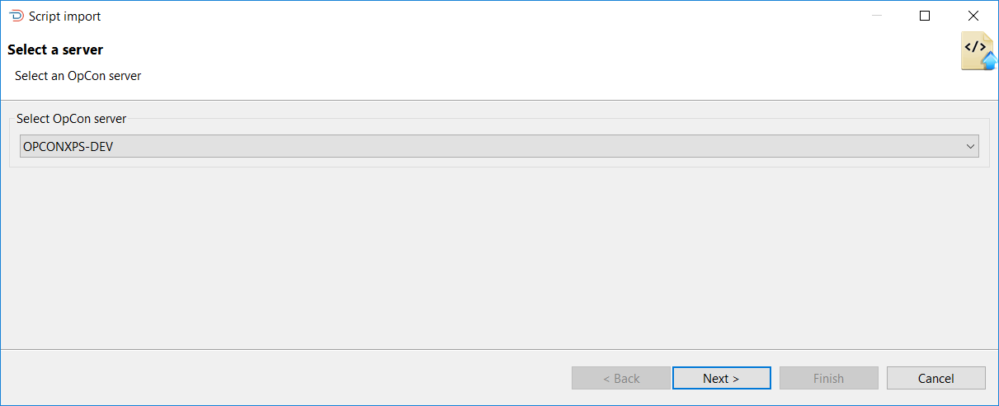
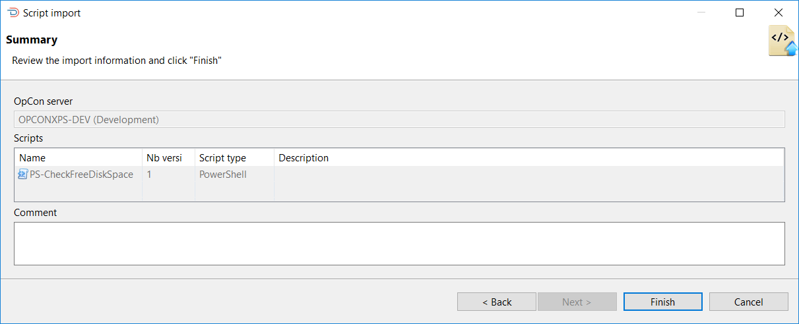
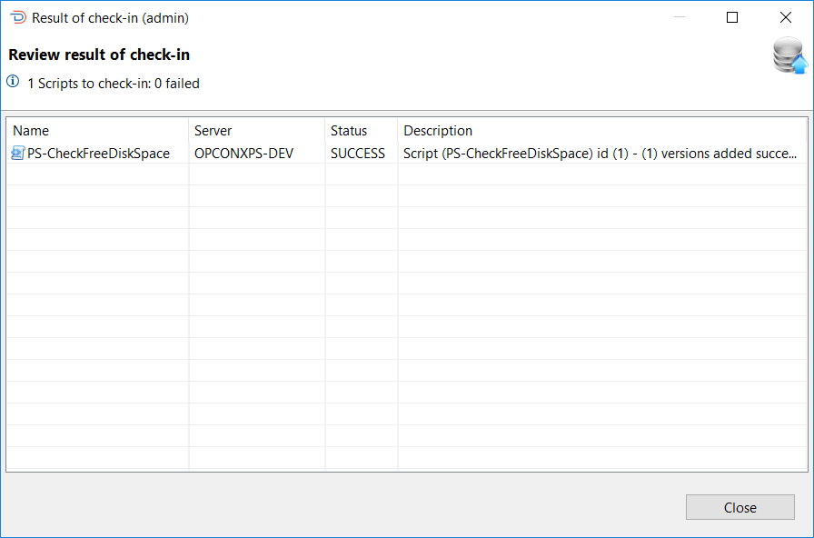
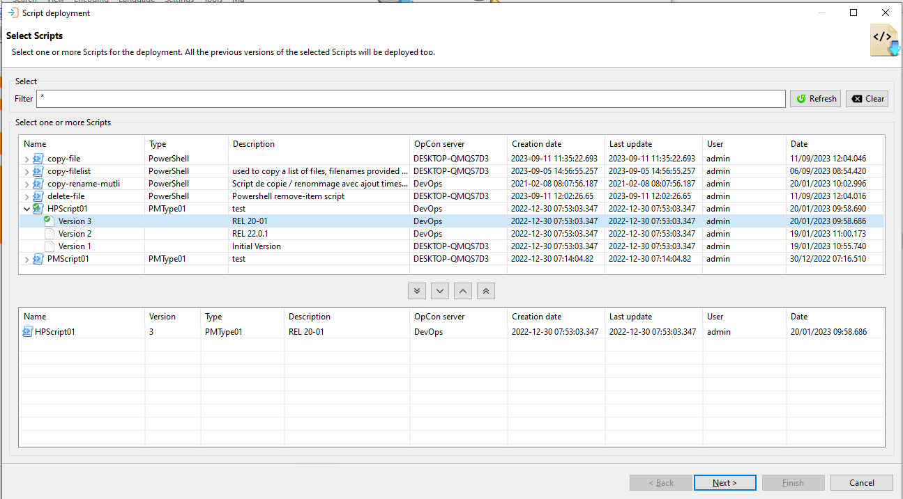
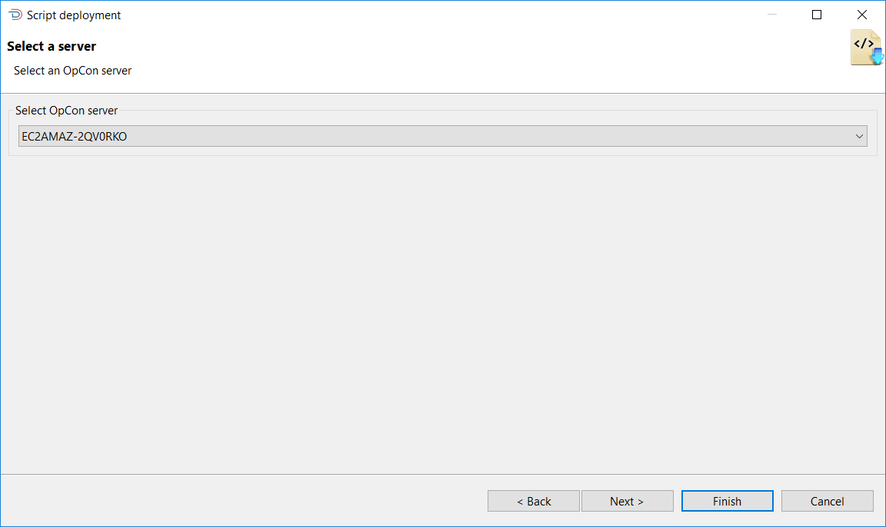
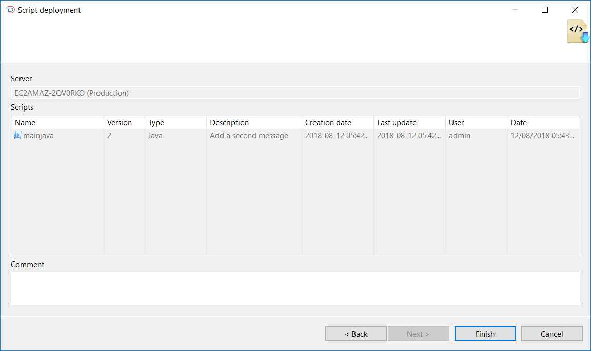
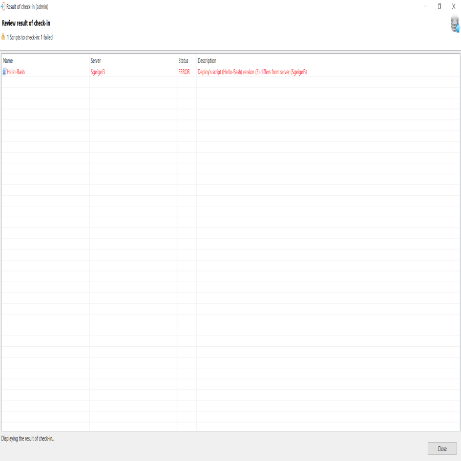
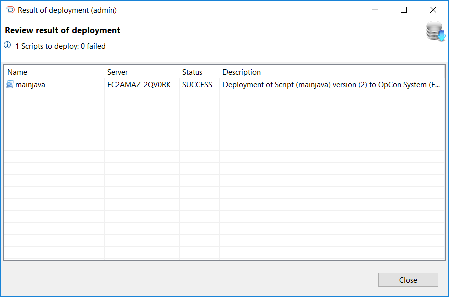
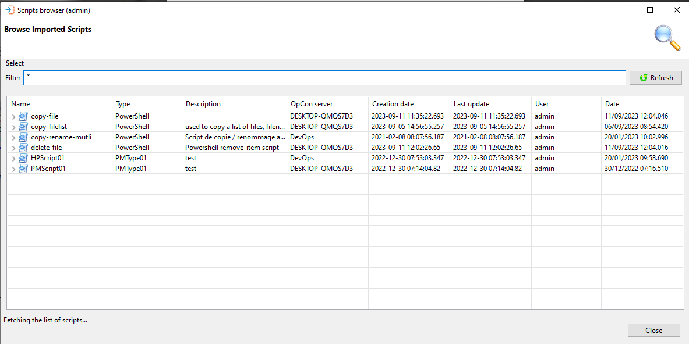
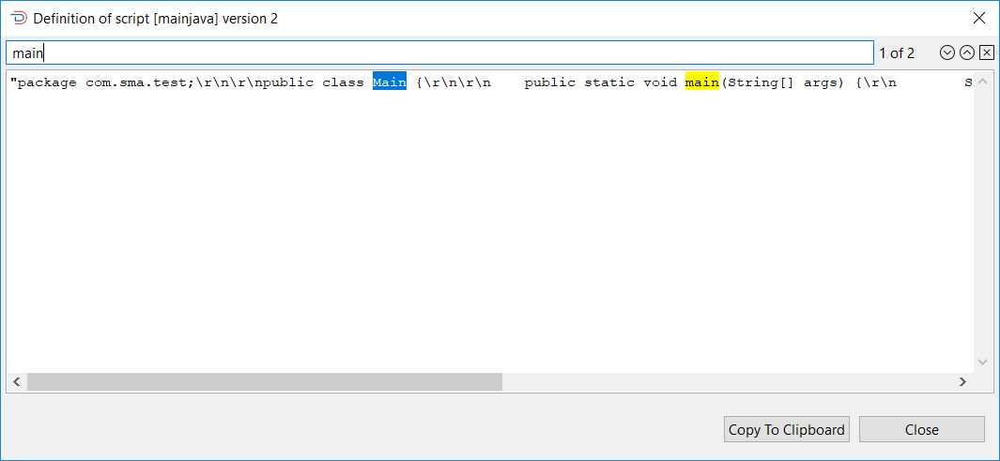

# Scripts

The Scripts functions support the capabilities required to import, view, and deploy script definitions. When importing scripts, if the script does not exist in the repository, the script, script type, script runner, and script versions are imported into the repository. If the script exists, then only the script versions are imported.

Before a script definition can be deployed to a target OpCon system, it must be registered with the OpCon Deploy system. Once registered, it can be included in a schedule for deployment or it can be deployed to target OpCon systems.

## Import

The Import function is used to register a script definition with the OpCon Deploy system. During the import process, the script name is selected from a source OpCon system. A check is made to see if the script already exists in the repository and if it does, all script versions greater than the latest script version in the repository are extracted from the OpCon system and inserted into the repository. If the script does not exist in the repository, all script versions present on the OpCon system are extracted and inserted into the repository.

It should be noted that scripts can also be inserted into the repository when a schedule is imported. If during the schedule import process, a script is encountered, a check is made to see if this version of the script already exists in the repository. If not, the version is added to the repository.

The import process is divided into two distinct phases with the first phase being the selection phase and the second phase the confirmation phase.

OpCon Deploy requires that each OpCon system participating in the OpCon Deploy environment requires a license. To enforce this, a check is made to determine if the requested system has a valid OpCon Deploy license. If the system does not have a valid license, the following message will be displayed:


## Import Selection Phase

The import process begins with the selection of the OpCon system to import the script from. Following that, various dialogs will be presented leading the user through the process.

To start the Import, select the Script Import function. The Script Import (Select a server) dialog appears and you will need to select, from the drop-down list, the OpCon system from which to import the script and then select the Next button. It should be noted that only OpCon systems defined in the OpCon Deploy database will appear in the list.



Once Next has been selected, the list of scripts will be retrieved from the chosen OpCon system and displayed in the Scripts list of the Script Import (Select one or more Scripts to import) dialog. Once the script list has been created, it is possible to filter the script names on the list by entering a value in the Filter by Script name field. It is possible to select multiple scripts to import from the source OpCon system by selecting the script names and then using the > arrow to move the script names to the right-hand list. Once script(s) has been selected, select the Next or Finish button.


When importing scripts, it is not necessary to select a script version as all missing versions will be retrieved during the import process.

Once Next has been selected, the selected script(s) will be displayed in the Script Import (Summary) dialog. This provides a summary of your selections, allows a description to be added to the script records.



If the script(s) has been inserted successfully into the repository, you will get a success message indicating that the script has been inserted for each selected script.



## Deploy

The OpCon Deploy process begins with the selection of the script version to deploy.

OpCon Deploy requires that each OpCon system participating in the OpCon Deploy environment requires a license. To enforce this, a check is made to determine if the requested system has a valid OpCon Deploy license. If the system does not have a valid license, the following message will be displayed:


To start the OpCon Deploy process, select the Script OpCon Deploy function. The Script Deployment (Select Scripts) dialog appears and you will need to select a specific version to deploy. 

The Select Scripts dialog presents a screen and a **Select** capability that allows you to enter a text string in the **Filter** field to retrieve specific scripts records or use the displayed default value of asterix (*) to retrieve all script records.
Once the text string has been entered select the **Refresh** button and the script information will be displayed. Subsequent requests will be added to the existing list. The **Clear** button can be used to reset the list of previously selected scripts. 

Scripts selected in the lower table, will remain in the upper selection screen after a reset.

It must be noted that wild cards are not supported, instead the text entered in the **Filter** field is checked against the script name in the script record (i.e. HP will return all script records that contain the character sequence in the name).



If the list of available versions is not visible, then click on the > indicator to the left of the script name and the list of versions will appear. To select a version either double-click on the version or select it and use the down arrow.

Once the scripts have been selected, select the Next button to select the OpCon system to which to deploy the scripts.



The target OpCon system can be selected from the drop-down list. Once the target system has been selected, select either the Next or Finish button. If the Next button is selected, the Script Deployment Summary dialog appears. It is possible to add a description in the comment field, which can be used to describe the reason for the deployment.



If the Script Deployment Summary dialog has been selected, select the Finish button to start the deployment process. When Finish is selected, a confirmation message will be displayed requesting the user to confirm that deployment must take place. When the deployment process finishes, there will be one entry per script version in the result dialog. If the deployment produces an error condition, the result will be colored red.

If OpCon Deploy detects its copy of the repository has a different existing version from what it is importing from OpCon, the import will stop and an error message will warn the user that the version history differs.



Click Close to return to the Script Deployment screen.



## Browse

This function provides the opportunity to display information about script definitions in the repository.

The Browse Imported Scripts dialog presents a screen and a **Select** capability that allows you to enter a text string in the **Filter** field to retrieve specific scripts records or use the displayed default value of asterix (*) to retrieve all script records.
Once the text string has been entered select the **Refresh** button and the script information will be displayed. Subsequent requests will result in the new selection being displayed. 

It must be noted that wild cards are not supported, instead the text entered in the value in the **Filter** field is checked against the script name in the script record (i.e. HP will return all script records that contain the character sequence in the name).




To update the list of scripts displayed in the Browse and filter Scripts imported window, click Refresh, located in the bottom right corner of the window next to the Close button.

### Browse and Filter Scripts Imported Columns

| Column | Description |
| ------ | ----------- |
| Name | The name of the script |
| Type | The script type which the script is associated |
| Description | The description of the script |
| OpCon Server | The name of the OpCon server that the script was imported from |
| Creation Date	| The date the script was created on the OpCon system |
| Last Update | The date the script was updated on the OpCon system |
| User | The name of the user that performed the last action on the script repository definition |
| Date | A timestamp when the last action was performed |

The high-level entry in the table contains the name of the script and the type. To see a list of versions in the repository, select the > in front of the script name. This will then display a list of all versions present in the database. The version information contains the version number, the date when the version was created on the OpCon system, the Last Update time of the script on the OpCon system, the user who imported the script into the repository, and the date when this was completed.

To view the script definition, perform a right-click on the definition in the list, select the View Script Content button and ```Definition of Script [<name>] version <n>``` will appear.

It is possible to search for a value in the script by entering the required value in the search field above the definition and selecting a search direction (forward or backward arrow). Selecting the X will remove the search result from the definition and the search field.



