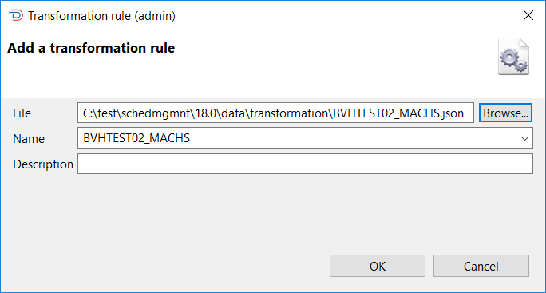
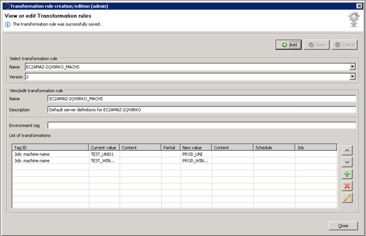
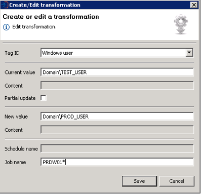
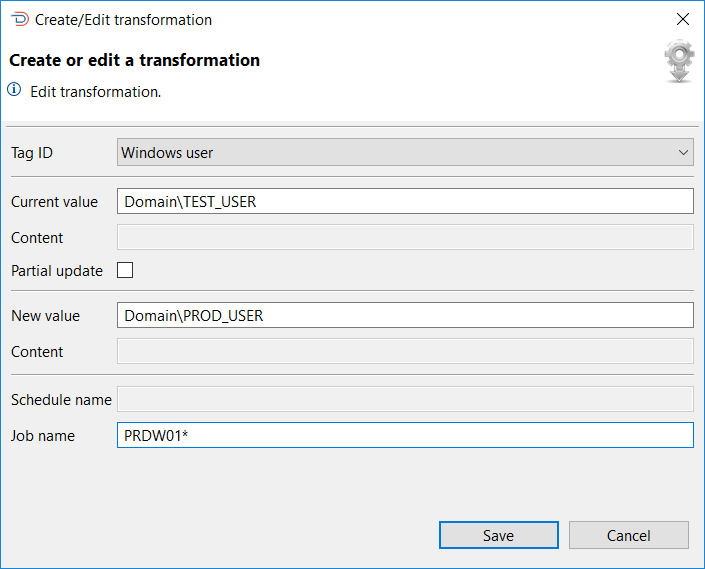
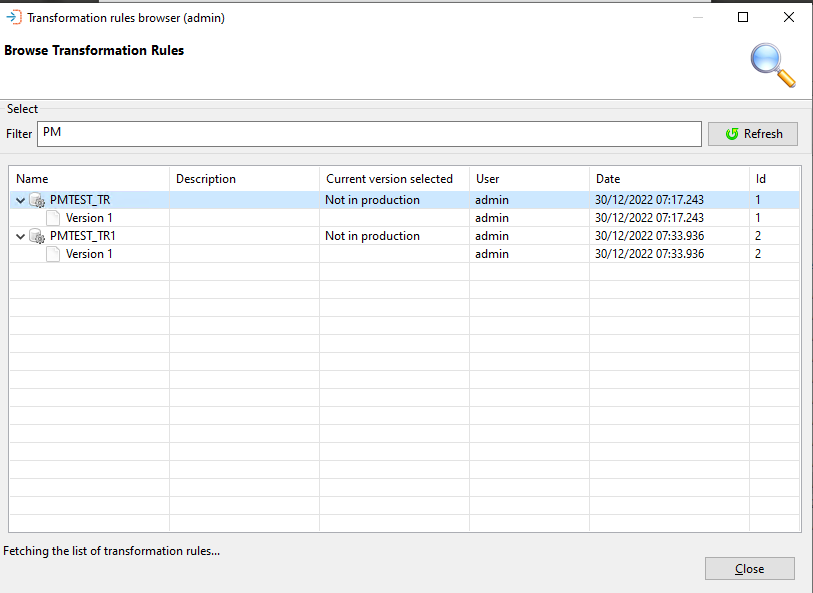
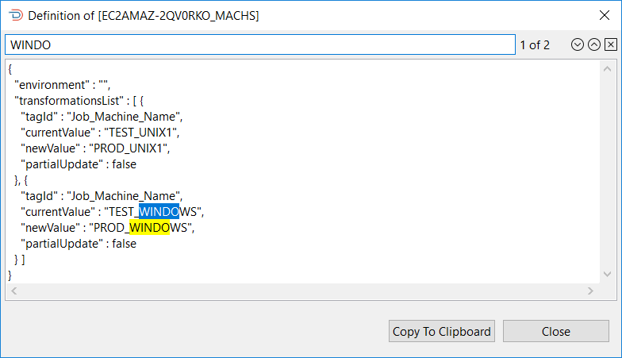
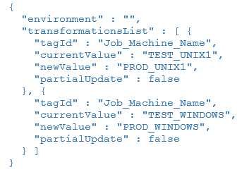
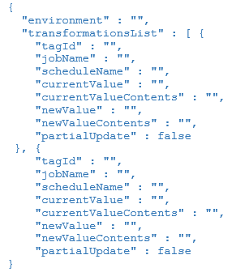

# Transformation Rules

## Overview

Transformation Rules can be used to transform a schedule definition during deployment to match the specific requirements of the target OpCon system.

* There are three areas where transformation rules can be applied:

#### Server Definition
* It is possible to add default transformation rules for a server which means that these rules will be applied each time a deployment process has been submitted for the system.
* The concept is to define the machine name or machine group and batch user transformations which are then added as default transformations for the server.
* Server transformations are included by an administrator.

#### Package Definition
* It is possible to add default transformation rules for a package which means that each time the package is deployed, the transformation rules will be applied.

#### Deployment
* During the deployment process, it is possible to select additional transformation rules which will be applied when the schedule or package is deployed.
 
* During the deployment process, the server definition is checked for default transformation rules and if a package is being deployed, the package is checked for default transformation rules. These rules are combined along with any additional rules added during the deployment process.

The transformation rules are applied in the following order:

* Server transformation rules
* Package transformation rules
* Deployment transformation rules

Other important points to note:

* The Transformation Rules functions support the capabilities required to insert and view transformation rules.
* Transformation Rules are versioned . This means that once a rule is defined, it is never overwritten, and a new version is created every time the rule is imported.
* Transformation Rules are defined using a JSON template and imported using the Transformation Rules Import File function.

## Import File

* The Import File function is used to import a transformation rule into the central repository. When importing a rule, a unique name must be given to the rule or the name selected from the list of existing rules defined in the database. When importing a new file, the file name will be used as the unique name. An optional description can be entered describing the contents of the transformation file.



### Add a Transformation Rule

* This next table describes each field displayed in the Add a transformation rule dialog. This dialog is used when adding a transformation rule to the central repository.

| Field | Description |
| ----- | ----------- |
| Name | A unique name given to the rule. Either enter a unique name or select a name from the drop-down list |
| Description | An optional field that can be used to describe the contents of the rule |
| File | The full pathname to the file containing the Transformation Rule definitions |

## Create/Edit

* The Create/Edit function is used to create new transformation rules or modify existing transformation rules. When selected, the transformation rule editor opens.

* Click Add to create a new transformation rule or select a transformation rule from the drop-down list to make one of the following changes to the rule:
    * Rename
    * Update Description
    * Update Environment Tag
    * Update List of Transformations

* When all changes have been completed, click Save to update the transformation rule. A new version is created each time the transformation rule is updated, with the exception of a rule rename. No new version is created if the only change to the transformation rule is a renaming.



* A transformation rule contains a list of transformations, displayed at the lower part of the Transformation Rule Editor. Use the toolbar buttons on the right side of the list to make changes to the transformations:
    * Click the Up arrow to move the priority of the transformation higher.
    * Click the Down arrow to move the priority of the transformation lower.
    * Click the Green Plus icon to add a new transformation.
    * Click the Red X icon to remove an existing transformation.
    * Click the Pencil icon to edit an existing transformation.

* After clicking the Green Plus or Pencil icons, the transformation editor opens. Define the transformation and Save.



* To change an existing rule, double-click on the rule and the Create or edit a transformation dialog will appear. To change the Tag ID, select a new tag from the drop-down list. Change or add definitions, as required, and select Save to update the rule.



* In the transformation rule editor, to create a new rule, select the green plus icon on the right-hand side. To remove a rule, select the red cross icon on the right-hand side. When all changes have been completed, select Save to update the transformation rule and create the initial or new version.

## Browse

* The Browse function provides the opportunity to display information about the transformation rule as well as the definitions associated with the rule.

The Browse Transformation Rules dialog presents a screen and a **Select** capability that allows you to enter a text string in the **Filter** field to retrieve specific transformation rule records or use the displayed default value of asterix (*) to retrieve all transformation rule records.
Once the text string has been entered select the **Refresh** button and the transformation rule information will be displayed. Subsequent requests will result in the new selection being displayed. 

It must be noted that wild cards are not supported, instead the text entered in the value in the **Filter** field is checked against the transformation rule name in the transformation rule record (i.e. PM will return all script records that contain the character sequence in the name).



* To update the list of transformation rules displayed in this window, click the Refresh button.

### Browse Transformation Rules

* This allows the information associated with a transformation rule to be displayed as well as the definitions associated with the transformation rule.

* The Browse Transformation Rules dialog presents a list of the filtered transformation records. This next table describes the information displayed in the dialog.

| Column | Description |
| ------ | ----------- |
| Name | The name of the transformation record |
| Description | The description entered when the transformation record was created |
| Current Version Selected | Indicates which version is in use |
| User | The user that performed the last action on the transformation rule record |
| Date | A timestamp of when the last action was performed |
| Id | The database record ID of the transformation rule |

* To view the transformation rule definitions, perform a right-click on the definition in the list and View Definition will appear then select this to view the JSON definition.

* It is possible to search for a value in the JSON by entering the required value in the search field above the definition and selecting a search direction (forward or backward arrow). Selecting the X will remove the search result from the definition and the search field.



## Defining Transformation Rules

* Defining transformation files consists of creating JSON files containing the transformation rules. A rule consists of a tag_id definition that defines the type of definition statement to transform, a current_value definition that defines the existing value in the definition, the new_value definition that contains the changes to be made to the definition, and the partial_update definition that indicates if the replacement is a partial update.



* A template JSON file is available in the template directory after the installation is complete. This next table identifies the tags that define the transformation rule values that are currently supported.

## Transformation Rule Definition Tags and Descriptions

### "environment" :""

* A special definition that defines a value that can be used to insert the same OpCon definition in a single target system by prefixed the value to schedule, resource, and threshold names (e.g., value of test results in ```test_<schedule name>```, ```test_<resource name>```, and ```test_<threshold name>```).

### "transformationList" :\[{..}\]

* A wrapper tag containing the list of transformation definitions.

### "tagID" :""

* Defines the change tag id and consists of one of the following values:
    * Container_Sub_Schedule_Name
    * Department_Name
    * Event
    * Event_Related_User
    * File_Transfer_Destination_Machine
    * File_Transfer_Source_Machine
    * Frequency_Name
    * Frequency_Use_Existing_Definitions
    * IBMi_User_Id
    * IBMi_Call_Information
    * IBMi_Job_Description
    * IBMi_Job_Queue
    * IBMi_Library_Current
    * IBMi_Job_Queue_Priority
    * IBMi_Output_Queue
    * IBMi_Library_Init_List
    * IBMi_Message_Logging_Level
    * IBMi_Message_Logging_Severity
    * IBMi_Message_Logging_Text
    * IBMi_Inquiry_Message_Reply
    * Job_Instance_Property
    * Job_Machine_Group_Name
    * Job_Machine_Group_Name_to_Machine_Name
    * Job_Machine_Name
    * Job_Machine_Name_to_Machine_Group_Name
    * Job_Name
    * Job_Tag
    * MCP_Arguments
    * MCP_File_Title
    * MCP_Prerun_Arguments
    * MCP_Prerun_File_Title
    * MCP_User
    * Move_Schedule_Package
    * OS2200_Account
    * OS2200_Elementname
    * OS2200_Filename
    * OS2200_Project
    * OS2200_Qualifier
    * OS2200_Runid
    * OS2200_Userid
    * Property_Name
    * Resource_Name,
    * Schedule_Build_For_All_Machines_In_Group
    * Schedule_Instance_Property
    * Schedule_Name
    * Schedule_Named_Instance
    * Script_Name
    * Threshold_Name
    * SQL_DTExec_Server
    * SQL_DTExec_Package_Path
    * SQL_DTExec_User
    * SQL_Job_Server
    * SQL_Job_Jobname
    * SQL_Job_User
    * SQL_Script_Server
    * SQL_Script_Database
    * SQL_Script_User
    * SQL_Script_Filename
    * Unix_GroupId_UserId
    * Unix_Group_Id
    * Unix_User_Id
    * Unix_Script_Arguments
    * Unix_Start_Image
    * Unix_Parameter
    * Windows_User
    * Windows_Script_Arguments
    * Windows_Command_Line
    * Windows_Working_Directory
    * ZOS_Batch_User
    * ZOS_DDName
    * ZOS_Event_Name
    * ZOS_Member_Name
    * ZOS_Prerun_File_Dataset_Name
    * ZOS_Prerun_Job_Task_Name
    * ZOS_Prerun_System
    * ZOS_Prerun_REXX_Name
    * ZOS_Prerun_REXX_DDName

### "jobName" :""

* Optional tag that limits the change to job data associated with the specified job name. It is possible to use the wild card character (```*```) in the job name and the rule will be applied to all jobs that start with the characters preceding the wild card character (e.g., JOB01*).
 
:::info 

Note When a job_name value is defined, a transformation rule without a job_name will not affect the definition that has been associated with a transformation rule that includes a job_name tag.

:::

### "scheduleName" :""

* Optional tag that limits the change to schedule data associated with the specified schedule name. It is possible to use the wild card character (```*```) in the schedule name and the rule will be applied to all schedules that start with the characters preceding the wild card character (e.g., SCHED01*).
 
:::info Note 

When a schedule_name value is defined, a transformation rule without a schedule_name will not affect the definition that has been associated with a transformation rule that includes a schedule_name tag.

:::

### "currentValue" :""

* Defines the existing definition value to match

### "currentValueContents" :""

* Optional tag used when Schedule_Instance_Property, Job_Instance_Property, Property_Name and Resource_Name definition types are defined and defines the existing value of the property contents to match.

### "newValue" :""

* Defines the value to replace in the definition if a match occurs.

### newValueContents" :""

* Optional tag used when Schedule_Instance_Property, Job_Instance_Property, Property_Name and Resource_Name definition types used when Schedule_Instance_property changes are defined and defines the value to replace in the definition if a match occurs.

### "partialUpdate" :false

* Indicates if this modification is a partial update or a full replacement.

Values are true for partial update or false for full replacement.

:::info Note 

Care should be taken when using partial updates across multiple schedules as the check is applied to all definitions of the same type.

:::

* This next graphic shows the transformation_template.json file. If tags are not needed, they can be omitted or defined as “”.




